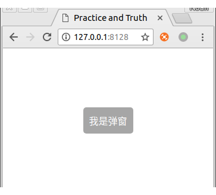

### 一. 先写一个普通的vue组件

文件位置 `/src/toast/toast.vue`
```
<template>
  <div>我是弹窗</div>
</template>
```
### 二. 在我们需要使用的页面引入组件,方便看效果和错误
```
<template>
  <div id="app">
    <toast></toast>
  </div>
</template>

<script>
  import toast from './toast/toast'
  export default {
    components: {toast},
  }
</script>
```


### 三. 实现动态加载组件

可以看到,已经显示出一个静态的弹出层了,接下来我们就来看看如何实现动态弹出.  

我们先在 `/src/toast/` 目录下面,新建一个`index.js`, 然后在index.js里面,敲入以下代码(由于该代码耦合比较严重,所以就不拆开一行一行讲解了,改成行内注释)

文件位置 `/src/toast/index.js`

```
import vue from 'vue'

// 这里就是我们刚刚创建的那个静态组件
import toastComponent from './toast.vue'

// 返回一个 扩展实例构造器
const ToastConstructor = vue.extend(toastComponent)

// 定义弹出组件的函数 接收2个参数, 要显示的文本 和 显示时间
function showToast(text, duration = 2000) {

  // 实例化一个 toast.vue
  const toastDom = new ToastConstructor({
    el: document.createElement('div'),
    data() {
      return {
        text:text,
        show:true
      }
    }
  })

  // 把 实例化的 toast.vue 添加到 body 里
  document.body.appendChild(toastDom.$el)

  // 过了 duration 时间后隐藏
  setTimeout(() => {toastDom.show = false} ,duration)
}

// 注册为全局组件的函数
function registryToast() {
  // 将组件注册到 vue 的 原型链里去,
  // 这样就可以在所有 vue 的实例里面使用 this.$toast()
  vue.prototype.$toast = showToast
}

export default registryToast
```

> 附一个传送门 [vue.extend 官方文档](https://cn.vuejs.org/v2/api/#Vue-extend)


### 四. 试用

到这里,我们已经初步完成了一个可以全局注册和动态加载的toast组件,接下来我们来试用一下看看

1. 在vue的入口文件(脚手架生成的话是`./src/main.js`) 注册一下组件

文件位置 `/src/main.js`
```
import toastRegistry from './toast/index'

// 这里也可以直接执行 toastRegistry()
Vue.use(toastRegistry)
```

2. 我们稍微修改一下使用方式,把`第二步` 的引用静态组件的代码,改成如下

```
<template>
  <div id="app">
    <input type="button" value="显示弹窗" @click="showToast">
  </div>
</template>

<script>
  export default {
    methods: {
      showToast () {
        this.$toast('我是弹出消息')
      }
    }
  }
</script>
```

 

可以看到,我们已经`不需要`在页面里面`引入`跟`注册`组件,就可以直接使用`this.$toast()`了.

现在我们已经初步实现了一个弹窗.